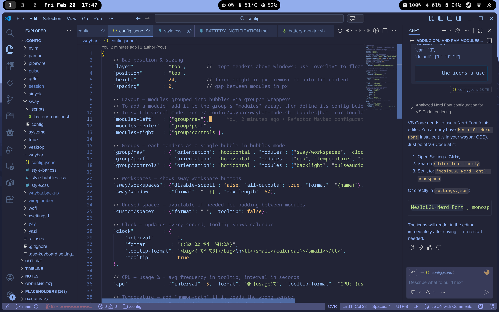
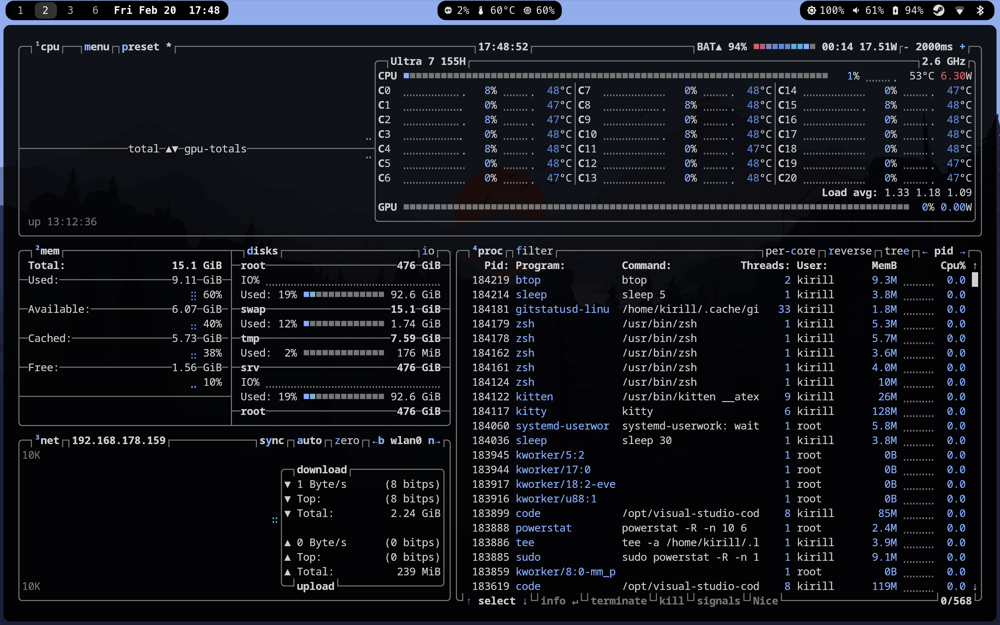

# Configuration Files

This repository contains my personal Linux configuration files for a complete Sway + Waybar setup with GNOME integration.

---






---

## System Overview

- **Window Manager**: SwayFX (Sway with visual effects)
- **Status Bar**: Waybar
- **Terminal**: Kitty
- **Application Launcher**: Wofi
- **File Manager**: Nautilus
- **Screenshots**: Grim + Slurp

## Required Packages

### Core Components
```bash
swayfx                    # Sway with effects (corner radius, blur, etc.)
waybar                    # Status bar
kitty                     # Terminal emulator
wofi                      # Application launcher
```

### Essential Utilities
```bash
grim                      # Screenshot utility
slurp                     # Region selector for screenshots
brightnessctl             # Backlight control
autotiling                # Automatic tiling layout
btop                      # System monitor
jq                        # JSON processor (for screenshots)
```

### GNOME Integration
```bash
nautilus                  # File manager
gnome-control-center      # Settings manager
polkit-gnome              # Authentication agent
gnome-keyring             # Credential management
gsd-xsettings             # GNOME settings daemon (gnome-settings-daemon package)
```

### Network & Bluetooth
```bash
network-manager-applet    # Network management (nm-applet)
blueman                   # Bluetooth manager
```

### Audio
```bash
pulseaudio                # Audio server
pavucontrol               # Volume control GUI
```

### Fonts
```bash
ttf-meslo-nerd            # MesloLGL Nerd Font (for waybar icons)
ttf-font-awesome          # Font Awesome icons
cantarell-fonts           # GNOME default font
```

## One-Command Installation

### For Arch/CachyOS (pacman/yay):
```bash
yay -S --needed swayfx waybar kitty wofi grim slurp brightnessctl autotiling btop jq nautilus gnome-control-center polkit-gnome gnome-keyring gnome-settings-daemon network-manager-applet blueman pulseaudio pavucontrol ttf-meslo-nerd ttf-font-awesome cantarell-fonts
```

### For Arch/CachyOS (minimal pacman only):
```bash
sudo pacman -S --needed sway waybar kitty wofi grim slurp brightnessctl autotiling btop jq nautilus gnome-control-center polkit-gnome gnome-keyring gnome-settings-daemon network-manager-applet blueman pulseaudio pavucontrol ttf-font-awesome cantarell-fonts
```
*Note: Install SwayFX and MesloLGL Nerd Font from AUR separately if needed*

## Post-Installation Setup

1. **Clone this repository**:
   ```bash
   git clone https://github.com/bk-bf/.config.git ~/.config-backup
   cp -r ~/.config-backup/* ~/.config/
   ```

2. **Create screenshots directory**:
   ```bash
   mkdir -p ~/Downloads
   ```

3. **Set wallpaper**:
   ```bash
   # Place your wallpaper at:
   ~/Pictures/wallpaper.png
   ```

4. **Enable services**:
   ```bash
   systemctl --user enable pipewire pipewire-pulse wireplumber
   ```

5. **Log out and select Sway** from your display manager

## Key Features

### Window Management
- **Super + Enter**: Open terminal
- **Super + D**: Application launcher (Wofi)
- **Super + Q**: Close window
- **Super + F**: Fullscreen toggle
- **Super + N**: File manager (Nautilus)
- **Super + 1-0**: Switch workspaces

### Screenshots
- **Print**: Area screenshot
- **Shift + Print**: Fullscreen screenshot
- **Ctrl + Print**: Window screenshot

### Appearance
- **Corner Radius**: 10px rounded corners
- **Gaps**: 5px inner gaps
- **Theme**: Dark GNOME-like aesthetic with transparent wofi launcher

### Gestures
- **3-finger swipe left/right**: Switch workspaces
- **3-finger swipe up**: Toggle fullscreen
- **3-finger swipe down**: Toggle floating
- **4-finger swipe left/right**: Move container to workspace

### Laptop Lid & Lock Screen
- Uses **GDM greeter** for lock screen (not swaylock) for better integration
- Closing the laptop lid triggers suspend to RAM and locks to GDM
- **Known issue**: Brief (~0.5s) visual delay on resume where Sway desktop is visible before GDM appears (cosmetic only, security is maintained)
- See [GDM_LOCK_DOCUMENTATION.md](sway/GDM_LOCK_DOCUMENTATION.md) for technical details

## Configuration Files

```
~/.config/
├── sway/config           # Main Sway configuration
├── waybar/
│   ├── config           # Waybar modules & layout
│   └── style.css        # Waybar styling
├── wofi/
│   ├── config           # Wofi behavior
│   └── style.css        # Wofi styling (matches waybar theme)
└── kitty/               # Terminal configuration
```

## Customization

### Change Keyboard Layout
Edit `~/.config/sway/config`:
```
input "type:keyboard" {
    xkb_layout de  # Change to your layout (us, uk, etc.)
}
```

### Adjust Transparency
Edit `~/.config/wofi/style.css`:
```css
background-color: rgba(0, 0, 0, 0.9);  /* Adjust last value (0.0-1.0) */
```

### Modify Waybar Modules
Edit `~/.config/waybar/config` to add/remove modules from the bar.

## Troubleshooting

### Waybar not appearing
```bash
killall waybar
waybar &
```

### GNOME services not starting
```bash
dbus-update-activation-environment --systemd DISPLAY WAYLAND_DISPLAY SWAYSOCK XDG_CURRENT_DESKTOP=GNOME
```

### Wofi not showing icons
Ensure you have icon themes installed:
```bash
sudo pacman -S papirus-icon-theme
```

## Credits

Configuration inspired by GNOME's aesthetic with the power and flexibility of Sway/i3.
