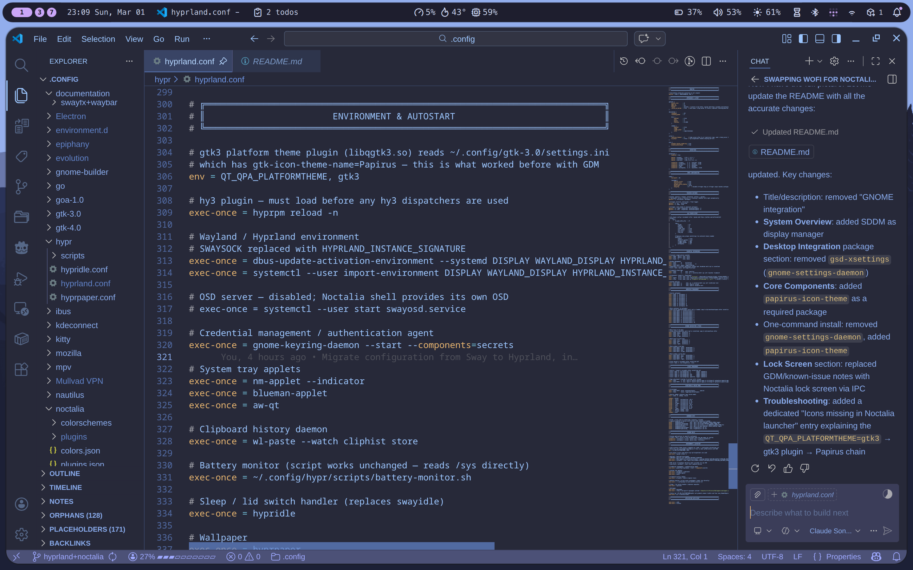
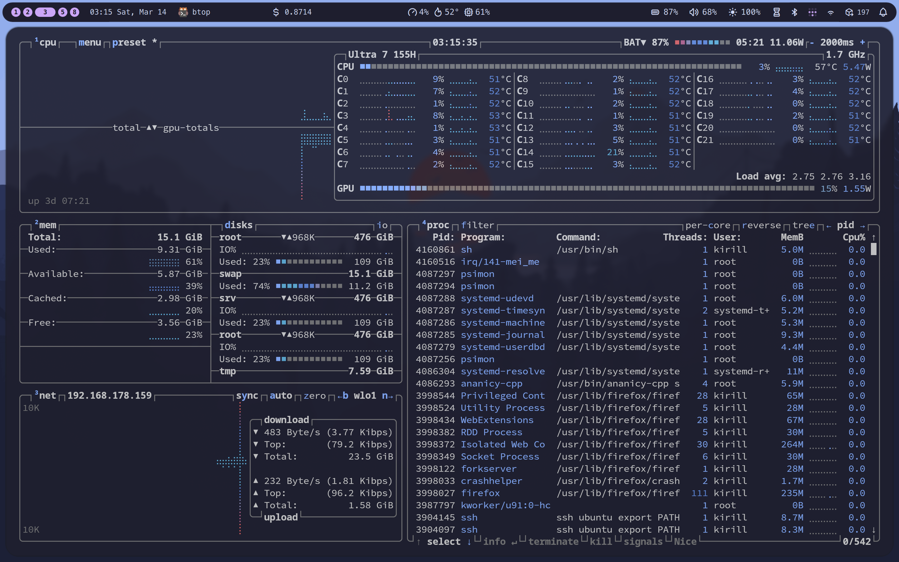

# Configuration Files

This repository contains my personal Linux configuration files for a Hyprland setup with Noctalia shell.

---





---

## System Overview

- **Window Manager**: Hyprland (scrolling layout — niri-like, built-in), managed via **UWSM** for proper systemd session integration
- **Display Manager**: SDDM + SilentSDDM Theme
- **Shell / Status Bar**: Noctalia (via QuickShell)
- **Terminal**: Kitty
- **Application Launcher**: Noctalia launcher
- **File Manager**: Nautilus
- **Screenshots**: Grim + Slurp
- **Idle / Sleep**: hypridle
- **Wallpaper**: hyprpaper
- **Clipboard**: cliphist + wl-paste (opened via Noctalia launcher)
- **Theme Sync**: Automated pipeline — Noctalia color tokens → GTK3/4 CSS + Kitty, driven by inotifywait

## Key Features

### Window Management
- **Super + F**: Cycle column width (33% → 50% → 100%)
- **Super + Shift + F**: Fullscreen toggle
- **Super + T**: Toggle instantly between dwindle and scrollable layout
- **Super + Enter** / **Ctrl + Enter**: Open terminal
- **Super + D**: Application launcher (Noctalia)
- **Super + C**: Clipboard history (Noctalia)
- **Super + Q**: Close window
- **Super + Shift + Space**: Toggle floating
- **Super + N**: File manager (Nautilus)
- **Super + 1–0**: Switch workspaces
- **Super + Shift + 1–0**: Move window to workspace
- **Super + R**: Enter resize mode (then vim/arrow keys; Escape/Enter to exit)
- **Super + −** / **Super + Shift + −**: Scratchpad

### Focus & Movement
- **Super + H/J/K/L** or **Super + Arrows**: Move focus
- **Super + Shift + H/J/K/L** or **Super + Shift + Arrows**: Move window

### Screenshots (saved to ~/Downloads)
- **Print**: Area screenshot
- **Shift + Print**: Fullscreen screenshot
- **Ctrl + Print**: Active window screenshot

### Theme Sync

Colors are driven end-to-end by **Noctalia's color tokens** — no manual hex editing required.

When Noctalia changes its active color scheme (or dark/light mode is toggled), an inotifywait
watcher detects the atomic rewrite of `~/.config/noctalia/colors.json` and triggers
`theme-sync.sh`, which in a single pass:

- Generates `@define-color` CSS variables for GTK3 and GTK4 from Noctalia tokens
- Writes kitty terminal colors (background, foreground, full 16-color ANSI palette)
- Live-reloads kitty via `SIGUSR1` (no restart needed)
- Restarts the polkit agent (GTK3 has no CSS live-reload)
- Sets the GNOME dconf accent color to match the primary hue
- Fires a desktop notification on completion

The watcher runs as a persistent **systemd user service** (`theme-watch.service`) with
auto-restart — it survives crashes and is bound to the graphical session lifecycle via
`graphical-session.target`.

Qt apps inherit GTK colors automatically via `QT_QPA_PLATFORMTHEME=gtk3` — no separate
Qt theming needed.

The token mapping, the watcher and the generated files are documented in the `noctalia` Claude Code skill (`~/.claude/skills/noctalia/`).

### Appearance
- **Corner Radius**: 20px rounded corners
- **Blur**: Enabled with vibrancy
- **Gaps**: 5px inner, 10px outer
- **Animations**: Smooth slide + overshot bezier curves

### Gestures
- **3-finger swipe up/down**: Switch workspaces (1:1 tracking)
- **3-finger swipe left/right**: Move focus between windows in the scrolling layout
- **4-finger swipe left/right**: Move window to adjacent workspace

### Laptop Lid & Lock Screen
- Uses **Noctalia's built-in lock screen** (`qs -c noctalia-shell ipc call lockScreen lock`)
- **hypridle** handles idle detection and triggers the lock screen before suspend
- Closing the laptop lid triggers **suspend-then-hibernate**: suspends to RAM immediately, auto-hibernates to disk after 45 min
- **Battery at 5%**: UPower triggers hibernate — full session preserved even if battery dies while lid is closed
- Display turns off after 4 minutes of inactivity

## Installation

```bash
git clone https://github.com/bk-bf/.config.git ~/.config
bash ~/.config/install.sh
```

`install.sh` installs all packages from `pkglist.txt` via `yay`, creates system symlinks,
enables user services, and detects hardware automatically (CPU/GPU/HiDPI/laptop).
On machines that aren't the Galaxy Book it skips hardware-specific tuning and prints what
to review manually. The full symlink map is in the `dotfiles` Claude Code skill
(`~/.claude/skills/dotfiles/`).

> Requires `yay` (or `paru`) to be installed first. The script will print bootstrap
> instructions if neither is found.

<details>
<summary>Manual package install (reference)</summary>

All packages are tracked per-machine in a private repo and auto-updated on every pacman
transaction (`~/.config/pkglist.txt` is a symlink to this host's list — see
`.docs/packages/PACKAGE_TRACKING.md`). To install manually:

```bash
yay -S --needed - < ~/.config/pkglist.txt
```

### Core Components
```
hyprland                  # Wayland compositor
quickshell                # Shell framework (qs) for Noctalia
hyprpaper                 # Wallpaper daemon
hypridle                  # Idle / sleep handler
kitty                     # Terminal emulator
papirus-icon-theme        # Icon theme (required for app icons in Noctalia launcher)
```

### Essential Utilities
```
grim                      # Screenshot utility
slurp                     # Region selector for screenshots
brightnessctl             # Backlight control
btop                      # System monitor
jq                        # JSON processor (screenshots + theme-sync)
cliphist                  # Clipboard history manager
wl-clipboard              # wl-paste (clipboard daemon)
```

### Desktop Integration
```
nautilus                  # File manager
gnome-control-center      # Settings manager
polkit-gnome              # Authentication agent (runs as systemd user service)
gnome-keyring             # Credential management
uwsm                      # Universal Wayland Session Manager (session target management)
xdg-desktop-portal-gnome # File picker via Nautilus
adw-gtk-theme             # GTK3/4 base theme (adw-gtk3-dark)
inotify-tools             # File watcher for theme-sync pipeline
```

### Network & Bluetooth
```
network-manager-applet    # Network management (nm-applet)
blueman                   # Bluetooth manager
```

### Audio
```
pipewire                  # Audio server
pipewire-pulse            # PulseAudio compatibility
wireplumber               # Session manager
pavucontrol               # Volume control GUI
```

### Fonts
```
ttf-meslo-nerd            # MesloLGL Nerd Font
cantarell-fonts           # GNOME default font
```

Package tracking is documented in the `dotfiles` Claude Code skill.

</details>

## Post-Installation Setup

1. **Set wallpaper**:
   ```bash
   # Place your wallpaper at:
   ~/Pictures/Wallpaper/wallpaper.png
   ```

2. **Run initial theme sync** (writes GTK CSS from current Noctalia colors):
   ```bash
   ~/.config/hypr/scripts/theme-sync.sh
   ```

3. **Log out and select Hyprland (uwsm)** from SDDM

## Configuration Files

```
~/.config/
├── install.sh                 # Post-clone setup — symlinks, services, hardware detection
├── pkglist.txt                # Symlink → this host's list in the private repo (auto-updated)
├── pkg-tracker.sh             # Bootstraps repo + regenerates/commits this host's pkglist
├── pkg-tracker.hook           # Pacman hook source — symlinked to /etc/pacman.d/hooks/
├── sddm/
│   └── sddm.conf              # Reference template — install.sh writes /etc/sddm.conf dynamically (HiDPI-aware)
├── grub/
│   └── grub                   # Symlinked to /etc/default/grub
├── intel-undervolt/
│   └── intel-undervolt.conf   # Symlinked to /etc/intel-undervolt.conf (Galaxy Book)
├── s2idle/
│   ├── s2idle-optimize.service  # Symlinked to /etc/systemd/system/ (Galaxy Book)
│   └── s2idle-optimize.sh       # Symlinked to /usr/local/bin/ (Galaxy Book)
├── hypr/
│   ├── hyprland.conf          # Main Hyprland configuration
│   ├── hypridle.conf          # Idle / sleep configuration
│   ├── hyprpaper.conf         # Wallpaper configuration
│   └── scripts/
│       ├── theme-sync.sh      # Reads Noctalia tokens → writes GTK/Kitty/dconf
│       ├── theme-watch.sh     # inotifywait loop, triggers theme-sync.sh
│       └── battery-monitor.sh
├── systemd/user/
│   ├── theme-watch.service    # Persistent watcher (WantedBy=graphical-session.target)
│   └── polkit-agent.service   # Auth agent with auto-restart
├── gtk-3.0/
│   ├── noctalia-colors.css    # Generated — do not edit
│   └── gtk.css                # @import + widget overrides
├── gtk-4.0/
│   ├── noctalia-colors.css    # Generated — do not edit
│   └── gtk.css                # @import only
├── kitty/
│   └── current-theme.conf     # Generated — do not edit
├── noctalia/
│   ├── settings.json          # Noctalia shell settings + darkModeChange hook
│   ├── colors.json            # Written by Noctalia on scheme change (watched)
│   ├── plugins.json           # Enabled plugins
│   ├── colorschemes/          # Color scheme definitions
│   └── plugins/               # Installed plugins
├── xdg-desktop-portal/
│   └── hyprland-portals.conf  # Routes FileChooser → gnome (Nautilus picker)
├── udev/
│   └── 99-disable-touchscreen.rules   # Copied to /etc/udev/rules.d/
└── .docs/                     # Archived history only — current docs are Claude Code skills
```

## Customization

### Change Keyboard Layout
Edit `~/.config/hypr/hyprland.conf`:
```
input {
    kb_layout = de  # Change to your layout (us, uk, etc.)
}
```

### Adjust Gaps / Rounding at Runtime
```bash
hyprctl keyword general:gaps_in 8
hyprctl keyword decoration:rounding 12
```
Or use the keybinding **Super + Z** / **Super + Shift + Z** to increment/decrement inner gaps.

## Troubleshooting

### Noctalia shell not starting
```bash
QT_QPA_PLATFORMTHEME=gtk3 qs -c noctalia-shell
```

### Icons missing in Noctalia launcher
Ensure `papirus-icon-theme` is installed and `QT_QPA_PLATFORMTHEME=gtk3` is set. The gtk3 Qt platform theme plugin reads `~/.config/gtk-3.0/settings.ini` (`gtk-icon-theme-name=Papirus`) to resolve app icons. This is set automatically in `hyprland.conf` via `env = QT_QPA_PLATFORMTHEME, gtk3`.

### Hyprland reload
```bash
hyprctl reload
# or
Super + Shift + R
```

## Credits

Built on top of [Hyprland](https://hyprland.org/), [Noctalia](https://github.com/nicowillis/noctalia) / [QuickShell](https://quickshell.outfoxxed.me/), [UWSM](https://github.com/Vladimir-csp/uwsm), and GNOME's desktop integration stack.
